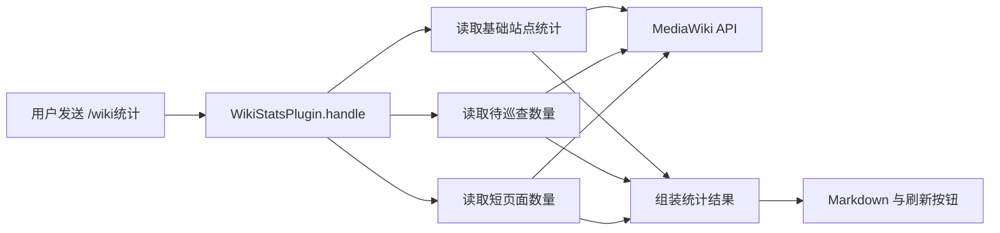

# CUWikiBot 业务插件架构记录

更新日期：2026-09-09

本文只记录 CUWikiBot 在上游 HiklQQBot 之上新增的业务能力。HiklQQBot 的消息接入、插件发现、权限、统计和回复发送机制均视为外部运行容器，不在本文展开。

## 当前定位

CUWikiBot 当前的业务目标是：用户在 QQ 中发送 `/wiki统计` 后，机器人读取未知伤亡中文维基的公开 MediaWiki API，汇总编辑进度并返回一条易读的统计消息。

目前只有 [`plugins/cu_stats.py`](plugins/cu_stats.py) 承担这部分业务。业务数据只从 Wiki 实时读取，不写入 Wiki，也不在本地持久化或缓存。

当前开发阶段以简单群聊命令为载体。MediaWiki 查询仍有已知问题，尚未完成真实目标站点下的业务验收。

## 业务数据流



一次命令按顺序执行以下步骤：

1. 确定本次使用的 MediaWiki API 地址。
2. 调用 `siteinfo/statistics` 获取页面、编辑和用户统计。
3. 再次调用统计接口，并在必要时探测 FlaggedRevs 的 `flaggedpages` 列表。
4. 分页调用 `querypage=Shortpages` 获取短页面条目数。
5. 将结果渲染为 Markdown，并尝试附带重新发送 `/wiki统计` 的刷新按钮。当前按钮缺少必填的 `button_id`，成功取数后会在这里抛出 `TypeError`，因此这一步尚未跑通。

这些步骤目前都在 `WikiStatsPlugin` 内完成，没有独立的业务服务层。

## 当前业务接口

### 命令入口

| 输入 | 当前行为 |
| --- | --- |
| `/wiki统计` | 查询默认 Wiki；当前成功取数后会因刷新按钮参数缺失而无法生成最终回复 |
| `/wiki统计 <HTTP URL>` | 将插件实例的 API 地址改为该 URL 后查询；这是现有实现，不应视为稳定或安全的公开能力 |
| 刷新按钮 | 设计上让用户再次发送 `/wiki统计`；当前无法成功构造 |

默认业务参数目前直接定义在 `plugins/cu_stats.py`：

| 参数 | 当前值 | 用途 |
| --- | --- | --- |
| `DEFAULT_API_URL` | `https://casualtiesunknown.huijiwiki.com/api.php` | 默认数据源 |
| `WIKI_NAME` | `未知伤亡` | 回复和帮助中的站点名称 |
| `SHORT_PAGE_THRESHOLD` | `170` | 回复中声明的短页面字节阈值 |
| `SAMPLE_LIMIT` | `500` | 回复中声明的样本数量 |
| `impersonate` | `chrome120` | `curl-cffi` 使用的浏览器指纹 |

### 输出数据

| 字段 | 当前来源 | 当前语义 |
| --- | --- | --- |
| 总页面数 | `siteinfo.statistics.pages` | MediaWiki 返回的页面总数 |
| 总编辑数 | `siteinfo.statistics.edits` | MediaWiki 返回的编辑总数 |
| 注册用户 | `siteinfo.statistics.users` | MediaWiki 返回的注册用户数 |
| 活跃用户 | `siteinfo.statistics.activeusers` | MediaWiki 返回的活跃用户数 |
| 待巡查页面 | `statistics.flaggedpages` | 仅在站点直接提供该字段时得到数字，否则显示不可用 |
| 短页面数 | `querypage=Shortpages` 的结果条数 | 实际使用站点配置的短页面规则，不等同于当前回复声明的 170 字节样本统计 |

## 边界与状态

`WikiStatsPlugin` 依赖以下外部边界：

- QQ 侧提供命令文本、调用者 ID 和群 ID，并负责发送最终回复。
- `curl-cffi` 负责访问可能受 Cloudflare 保护的 Wiki API。
- MediaWiki API 提供公开、只读的统计数据。

插件目前没有自己的数据库、定时任务或缓存。每次命令都会重新访问 Wiki。

`self.api_url` 是进程内可变状态。任一用户通过命令修改它后，后续用户会继续使用修改后的地址，直到进程重启或再次修改。插件导入的 `stats_manager` 当前没有被使用；框架自身的命令使用统计不属于 Wiki 统计业务。

## 失败处理

- 基础站点统计请求失败时，整次命令返回“无法连接 MediaWiki API”。
- 待巡查数量失败时，其他统计仍可返回，该字段显示“未启用或无法获取”。
- 短页面请求失败时，其他统计仍可返回，该字段显示“样本获取失败”。
- HTTP 非 200、JSON 解析错误和请求异常都由 `_api_request` 转换为 `None`，并写入日志。
- 三项数据成功返回后，刷新按钮构造会因缺少 `button_id` 抛出 `TypeError`；外层只能将其视为插件内部错误。

这种策略允许次要指标降级，但目前无法区分网络故障、站点不支持、API 参数错误和返回结构变化。

## 已知业务问题

以下问题应在扩大业务范围前处理：

1. **成功取数后仍无法回复。** `make_command_button()` 要求 `button_id`，当前调用没有传入，导致结果组装阶段抛出 `TypeError`。
2. **自定义 API 地址不安全。** 用户输入未经校验即可访问任意 HTTP 地址，并会修改所有用户共享的插件状态，存在 SSRF 和跨用户污染风险。
3. **短页面指标名实不符。** 当前实际统计 Wiki 的系统 `Shortpages` 查询页，却显示为“500 页样本、170 字节阈值”；`count_short_pages()` 没有进入实际命令路径。
4. **待巡查数量只完成探测。** 当 `statistics.flaggedpages` 不存在时，代码只确认扩展是否可调用，没有分页统计真实数量。
5. **重复请求。** 基础统计和待巡查逻辑分别请求同一份 `siteinfo/statistics` 数据，一次命令至少产生重复访问。
6. **请求成本不受控。** 短页面查询会持续分页直至结束，`SAMPLE_LIMIT` 当前不限制请求量。
7. **缺少业务测试。** 目前没有固定 MediaWiki 响应样本，也没有针对字段缺失、分页、错误响应和输出语义的自动检查。
8. **配置写死在代码中。** API 地址、站点名、阈值和浏览器指纹只能通过修改源码调整。

## 后续开发边界

当前阶段应保持实现简单：业务仍可放在单个插件中，但新增代码应围绕“读取统计快照并格式化结果”展开，避免依赖 HiklQQBot 的内部数据库或扩展其通用框架能力。

优先处理顺序：

1. 修正刷新按钮参数，并用固定响应确认完整结果能够生成。
2. 固定或严格限制可访问的 Wiki API 地址，移除跨用户共享的地址修改。
3. 明确定义“短页面”和“待巡查页面”的业务口径，再让查询与展示遵循同一口径。
4. 复用一次基础统计响应，并限制单次命令的最大请求量和总耗时。
5. 为响应解析和分页留下最小可运行测试，再进行目标 Wiki 的只读验收。

在上述问题解决前，不应基于当前统计结果制作排行榜、历史趋势、定时播报或持久化报表。

## 未来迁移契约

如果机器人需要做大并迁移到其他正式框架，应保留业务契约，替换 QQ 框架适配部分。

建议保留的业务输入：

- 命令：`/wiki统计`
- 固定或受控的 Wiki 数据源
- 可选的调用者标识，仅用于回复展示和按钮权限

建议形成的框架无关统计快照：

```text
WikiStatsSnapshot
├── pages: int
├── edits: int
├── users: int
├── active_users: int
├── pending_pages: int | None
├── short_pages: int | None
└── source_url: str
```

迁移时需要替换的部分：

- `BasePlugin` 子类和命令注册方式
- `Reply`、Markdown 和按钮的数据结构
- QQ 用户、群和事件字段的提取方式
- 回复发送和权限校验方式

MediaWiki 查询、统计口径和结果格式化应尽量保持为普通 Python 逻辑。这样迁移框架时只需重写薄适配层，而不必重新验证全部业务规则。

以下任一条件出现时，应优先评估迁移，而不是继续扩展当前框架：

- 需要稳定的 Webhook、频道或多账号支持
- 需要高并发、任务队列、定时任务或长期缓存
- 需要系统化权限、审计、监控或故障恢复
- 业务插件数量明显增加，开始共享复杂状态
- QQ API 协议升级导致现有接入层需要大范围重写
