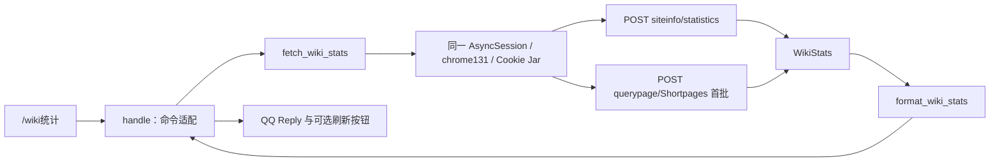

# CUWikiBot 业务插件架构记录

更新日期：2026-09-09

本文只记录我们实际维护的 Wiki 统计业务，不展开 HiklQQBot 的基础框架机制。

## 当前定位与组织方式

项目预计最多三人使用。业务保留在 [`plugins/cu_stats.py`](plugins/cu_stats.py) 一个文件中，配置直接放在文件顶部；目前不需要配置服务、通用客户端接口、缓存或独立业务包。

文件按以下职责组织：

| 位置 | 职责 |
| --- | --- |
| 顶部常量 | Wiki 地址、站点名、Chrome 指纹、请求超时和短页面读取上限 |
| `_api_request()` | 使用已有会话请求 API，检查 HTTP、JSON、API 错误和基本响应结构 |
| `fetch_wiki_stats()` | 管理一次任务的会话，查询基础统计和短页面，返回 `WikiStats` |
| `WikiStats` | 普通 Python 数据对象，记录基础统计、短页面已读数量、是否有后续和是否来自站点缓存 |
| `format_wiki_stats()` | 纯格式化，不访问网络，不调用 QQ |
| `WikiStatsPlugin.handle()` | 校验命令参数，调用查询，构造 `Reply` 和刷新按钮 |



`/wiki统计` 不接受附加参数。数据源只由维护者修改 `DEFAULT_API_URL`，不再允许聊天消息传入任意 URL，也不存在跨用户共享的可变 API 地址。

## 网络与 Cookie 会话

参考 `dodo_wiki_updater_gui/src/cu_wiki_bot/curl_client.py` 的实现，采用 **Chrome 指纹模拟 + Cookie 会话保持**：

```python
async with curl_requests.AsyncSession(impersonate="chrome131") as session:
    # 本次统计任务的所有 API 调用都使用 session.post(...)
    ...
```

使用异步会话适配现有 QQ 事件循环；传输仍由 `curl-cffi` 完成。请求发往官方 `/api.php`，参数放在 POST 表单中。浏览器请求头交给指纹预设生成，避免原先 Chrome 118 User-Agent 与其他版本指纹不一致。

Cookie 完全由 Session 的 Cookie Jar 保存和复用，不手工解析、不硬编码 `cf_clearance`，也不读取浏览器 Cookie。本次基础统计和短页面查询串行共用一个 Session；任务结束后关闭，不跨命令持久化 Cookie。当前只读公开统计，不登录 Wiki。

这是降低触发防护概率的传输方式，不是 JavaScript challenge solver；也不保证一定能通过站点防护。固定指纹可能随站点规则变化而失效。收到 HTTP 错误或非 JSON 验证页面时记录失败，不反复尝试过盾。

当前顶部配置：

| 参数 | 默认值 |
| --- | --- |
| `DEFAULT_API_URL` | `https://casualtiesunknown.huijiwiki.com/api.php` |
| `WIKI_NAME` | `未知伤亡` |
| `CHROME_FINGERPRINT` | `chrome131` |
| `REQUEST_TIMEOUT` | 每次请求 15 秒 |
| `SHORT_PAGE_LIMIT` | 500 条，调整范围为 1–500 |

一次命令最多两次 API 请求，不自动重试、不并行、不跟随重定向。Cookie 生命周期是一次统计任务；若将来需要登录后连续执行多个操作，再让整个操作任务共用一个会话，并补充身份校验。参考项目的登录回退、编辑和上传能力不属于当前业务。

## 指标与失败行为

| 输出 | 来源与口径 |
| --- | --- |
| 总页面数、总编辑数、注册用户、活跃用户 | `siteinfo.statistics` 对应字段；缺失或无效值显示“无法获取”，不伪造为 0 |
| 待巡查页面 | 暂不可用，目标站巡查机制、权限和统计口径尚待确认 |
| 短页面列表 | `querypage=Shortpages` 首批返回条数；有 continuation 时显示“列表还有后续”，有 `cached` 标记时显示“站点缓存” |

短页面数量是**本次读取的列表条数**，不是“170 字节以下的页面总数”，不是随机样本，也不用于推算全站。即使没有 continuation，也仅代表 API 返回列表读完；站点查询页可能有缓存或结果总数限制。[MediaWiki Querypage 文档](https://www.mediawiki.org/wiki/API:Querypage)

旧代码的 `count_short_pages()` 未被调用，且将 `allpages` 列表与页面长度属性混用，已删除；未生效的 `SHORT_PAGE_THRESHOLD`、`SAMPLE_LIMIT` 也一并移除。没有把它们包装成新的配置项。

原有 `flaggedpages` 探测既不能计算真实待巡查数量，也不能证明其等同于 MediaWiki 巡查。FlaggedRevs 的未审核页面、已有审核版本后发生修改的页面具有不同含义，不能直接混用。[FlaggedRevs API 文档](https://www.mediawiki.org/wiki/Extension:FlaggedRevs#API)

失败处理保持简单：

- 基础统计整体不可用：返回错误文本，终止后续请求。
- 短页面不可用：保留基础统计，该项显示获取失败。
- HTTP 200 中的 `error` / `errors`、无效 JSON 和缺失必要结构都不会当作成功。
- 刷新按钮已补齐 `button_id`；没有调用者 ID 时省略按钮，避免生成 `[None]` 权限列表。

当前仍以 Markdown 输出统计，实际发送受到 QQ 平台权限限制；本次未更改 QQ 框架的用户身份解析，也未做真实 QQ 消息验收。

## mwclient + mwparserfromhell 评估

**结论：基本只读接入已验证可行，但当前不值得整体重写，也不需要同时引入这两个库。** 继续使用现有异步 `curl-cffi` 是当前更省维护的方案；未来按具体业务分别引入。

### 各自解决什么问题

| 方案 | 对当前业务的价值 | 代价与边界 |
| --- | --- | --- |
| 现有 `curl-cffi.AsyncSession` | 两次 JSON 查询已足够；直接复用 Cookie，不阻塞事件循环 | 自行检查 API 错误和所需字段 |
| `mwclient` | 封装站点、页面、分类、修订、登录、迭代和 API 错误处理；后续业务变多时有价值 | 同步调用，需要在线程中运行；会自动补充部分 API 参数；仍需保留业务指标校验 |
| `mwparserfromhell` | 分析维基文本中的模板、参数、链接等 | 当前统计只有 JSON，完全不需要解析器；它不负责网络访问，也不执行模板展开 |

`mwclient` 的 `pool` 参数文档规定接收 `requests.Session`；接入 `curl-cffi.Session` 的基本路径已实测成功，但不能据此认定所有认证、重试和异常路径兼容。特别是 `curl_cffi` 的 Timeout 不继承 `requests.exceptions.Timeout`，而 `mwclient` 的网络重试捕获后者。其默认重试次数和等待也不适合直接照搬到聊天命令。[mwclient 源码及构造参数](https://mwclient.readthedocs.io/en/latest/_modules/mwclient/client.html)

`mwclient` 的 `api_chunk_size` 只控制每批数量，`max_items` 才限制迭代条数；即便换库，也不能把批大小当作总数上限。[mwclient 迭代说明](https://mwclient.readthedocs.io/en/stable/user/implementation-notes.html)

`mwparserfromhell` 接收已经获取的源文本，因此既可与 `mwclient` 配合，也可以直接接在现有 `curl-cffi` 后面。它不需要与某个访问库绑定，也不能代替 MediaWiki 的服务端渲染。[解析器接入示例](https://mwparserfromhell.readthedocs.io/en/stable/integration.html)、[解析器限制](https://mwparserfromhell.readthedocs.io/en/stable/limitations.html)

### 本次验证证据

2026-09-09，在当前开发环境临时安装 `mwclient 0.11.0`、`mwparserfromhell 0.7.2` 与 `curl-cffi 0.16.3` 进行只读比较，未将候选库加入项目依赖：

| 检查 | 结果 |
| --- | --- |
| `mwclient` 默认 requests 传输，GET | 目标站返回 HTTP 403 |
| `mwclient + curl-cffi`，Chrome 120 GET，包括对齐旧 UA | 目标站返回 HTTP 403 |
| 整理中的原生异步 `curl-cffi` GET | 曾成功，说明前述 403 不能简单归因于客户端名称 |
| 最终 `curl-cffi.AsyncSession(chrome131)`，POST，共用会话 | 基础统计与首批 500 条短页面成功，响应确认有后续 |
| `mwclient + curl-cffi.Session(chrome131)`，POST，共用会话 | 基础统计与 1 条短页面读取成功 |
| 本地模拟 API + `mwclient/curl-cffi` | 基本 JSON 读取成功 |
| 本地维基文本 + `mwparserfromhell` | 模板参数解析成功 |
| 本地 HTTP 服务 + 最终异步查询实现 | 首次响应设置的测试 Cookie 在第二次 POST 中自动携带 |

目标站当次返回基础统计：页面 3432、编辑 14449、用户 77、活跃用户 0。这是当次返回值，不是持续可用性或指标时效性的保证。

检查请求和源码还确认：`mwclient` 高层 query 会自动附加 `userinfo` 等参数。因此上述访问差异涉及 HTTP 方法、参数、指纹等多项变化；本次没有单独证明哪一项导致 403，也没有验证所有登录或分页路径。

### 何时考虑迁移

增加多项页面、分类、修订或登录业务时，可采用：`handle → asyncio.to_thread(完整 Wiki 任务) → mwclient.Site(pool=curl_cffi.Session(chrome131))`。在线程内创建、使用并关闭会话，显式使用 POST，限制超时和重试。三人使用规模下线程开销不是主要障碍；但取消异步等待不会自动停止已经运行的同步线程。

需要提取模板参数时，再单独加入 `mwparserfromhell`。届时保留 `WikiStats` 和展示逻辑，只替换查询函数；不必同时重写 QQ 插件。现在不引入同步适配、登录回退或通用 Wiki 客户端。

## 验证与后续开发

保留一个标准库回归检查文件 [`tests/test_cu_stats.py`](tests/test_cu_stats.py)，覆盖这次变更的查询、降级、指标展示、命令参数和按钮构造，不追求完整业务测试：

```bash
uv run python -m unittest discover -s tests
```

下一步按实际需要确认待巡查定义，或实现明确的短页面字节阈值查询。真实 QQ 发送、登录访问、长期网络稳定性和全量分页仍不在此次验证范围。

日后更换 QQ 框架时，主要替换 `WikiStatsPlugin`、`Reply` 和按钮构造。网络查询与格式化已不使用 QQ 对象，暂不必为了可能的迁移拆分更多文件。
