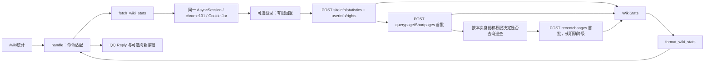

# CUWikiBot 业务插件架构记录

更新日期：2026-09-09

本文只记录我们实际维护的 Wiki 统计业务，不展开 HiklQQBot 的基础框架机制。

## 当前定位与组织方式

业务保留在 [`plugins/cu_stats.py`](plugins/cu_stats.py) 一个文件中，非敏感配置直接放在文件顶部，凭据来自本地环境；目前不需要配置服务、通用客户端接口、缓存或独立业务包。

文件按以下职责组织：

| 位置 | 职责 |
| --- | --- |
| 顶部常量 | Wiki 地址、站点名、Chrome 指纹、超时、首批读取上限及巡查命名空间 |
| `_api_request()` / `WikiApiError` | 使用已有会话请求 API，限制剩余预算，分类 HTTP、JSON、API 错误与警告；不强制要求登录响应含 query |
| `_credentials()` / `_login()` | 从环境取得可选凭据，执行最多四次请求的有限登录流程 |
| `_identity()` / `WikiIdentity` | 解析当前会话身份及权限；匿名不保存 IP，缺失信息保留未知状态 |
| `_patrol_params()` / `_fetch_patrol()` | 校验源码配置，按需判断权限，读取并校验单批 RecentChanges |
| `fetch_wiki_stats()` | 管理一次任务的会话，组合登录、基础统计、Shortpages 和巡查，保留单项降级原因 |
| `WikiStats` / `PatrolStats` | 记录身份、各项结果或失败原因、读取完整性；巡查的更改数与其中新建来自同一批记录 |
| `format_wiki_stats()` | 纯格式化，不访问网络，不调用 QQ |
| `WikiStatsPlugin.handle()` | 校验命令参数，调用查询，构造 `Reply` 和刷新按钮 |



`/wiki统计` 不接受附加参数。数据源只由维护者修改 `DEFAULT_API_URL`，不再允许聊天消息传入任意 URL，也不存在跨用户共享的可变 API 地址。

## 网络与 Cookie 会话

参考 `dodo_wiki_updater_gui/src/cu_wiki_bot/curl_client.py` 的实现，采用 **Chrome 指纹模拟 + Cookie 会话保持**：

```python
async with curl_requests.AsyncSession(impersonate="chrome131") as session:
    # 本次统计任务的所有 API 调用都使用 session.post(...)
    ...
```

使用异步会话适配现有 QQ 事件循环；传输仍由 `curl-cffi` 完成。请求发往官方 `/api.php`，参数放在 POST 表单中。浏览器请求头交给指纹预设生成，避免原先 Chrome 118 User-Agent 与其他版本指纹不一致。

Cookie 完全由 Session 的 Cookie Jar 保存和复用，不手工解析、不硬编码 `cf_clearance`，也不读取浏览器 Cookie。登录、基础统计、短页面和巡查查询串行共用一个 Session；任务结束后关闭，不跨命令持久化 Cookie。凭据来自本地 `.env` 或优先级更高的环境变量；均为空时匿名运行，仅填写一项时明确报告配置不完整并继续尝试公开统计。

这是降低触发防护概率的传输方式，不是 JavaScript challenge solver；也不保证一定能通过站点防护。固定指纹可能随站点规则变化而失效。收到 HTTP 错误或非 JSON 验证页面时记录失败，不反复尝试过盾。

当前顶部配置：

| 参数 | 默认值 |
| --- | --- |
| `DEFAULT_API_URL` | `https://casualtiesunknown.huijiwiki.com/api.php` |
| `WIKI_NAME` | `未知伤亡` |
| `CHROME_FINGERPRINT` | `chrome131` |
| `REQUEST_TIMEOUT` | 每次请求 15 秒 |
| `TASK_TIMEOUT` | 整次网络任务 60 秒；后续请求使用剩余预算与单请求超时的较小值 |
| `SHORT_PAGE_LIMIT` | 500 条，调整范围为 1–500 |
| `PATROL_LIMIT` | 500 条，严格校验整数 1–500；只读一批，不自动分页 |
| `PATROL_NAMESPACES` | `None` 表示所有可见命名空间；非空非负整数元组表示指定范围，例如 `(0,)` |

公开基础统计和 Shortpages 共两次请求；具备巡查权限时增加一次 RecentChanges 请求。登录最多增加四次：token、login、指定原因下的 clientlogin 回退、一次可跳过密码重置的继续请求。其他交互和 NeedToken 不重试。登录后基础统计合并 userinfo/rights，以规范用户名断言身份；后续认证查询继续携带 assert=user/assertuser。登录失败停止认证流程并明确降级到公开统计，不声称认证成功。请求串行、不跟随重定向，最多七次；单请求默认 15 秒、整次网络任务默认 60 秒；预算耗尽停止新增请求并保留已读结果。

初始化不联网；每次命令和刷新都执行相同流程，不缓存权限或统计结果。缺少 `patrol` 和 `patrolmarks` 时跳过巡查；有权限仍以实际请求结果为准。身份未知或权限字段缺失时保留公开结果，巡查显示能力无法确认。模块与配置不通过额外的 `paraminfo` 请求预检，也不建立匿名／登录两套能力模型。

参考工具的同步登录代码只作为流程参考，本项目使用现有异步请求层。仅当 `login` 返回 `Aborted` 且原因指向 `clientlogin` 时回退；仅当交互列表只有一个可跳过密码重置要求时继续一次。混合其他要求、验证码、二次验证、外部跳转或再次交互均停止，不传递完整认证响应给聊天或日志。

## 指标与失败行为

| 输出 | 来源与口径 |
| --- | --- |
| 总页面数、总编辑数、注册用户、活跃用户 | `siteinfo.statistics` 对应字段；缺失或无效值显示“无法获取”，不伪造为 0 |
| 待巡查更改及其中新建 | 原生 Patrol：recentchanges 首批，rcshow=!patrolled、rctype=edit\|new；其中新建是该批新建记录条数，受当前可见保留窗口和读取上限约束 |
| 短页面列表 | `querypage=Shortpages` 首批返回条数；有 continuation 时显示“列表还有后续”，有 `cached` 标记时显示“站点缓存” |

短页面数量是**本次读取的列表条数**，不是“170 字节以下的页面总数”，不是随机样本，也不用于推算全站。即使没有 continuation，也仅代表 API 返回列表读完；站点查询页可能有缓存或结果总数限制。[MediaWiki Querypage 文档](https://www.mediawiki.org/wiki/API:Querypage)

旧代码的 `count_short_pages()` 未被调用，且将 `allpages` 列表与页面长度属性混用，已删除；未生效的 `SHORT_PAGE_THRESHOLD`、`SAMPLE_LIMIT` 也一并移除。没有把它们包装成新的配置项。

原有 `flaggedpages` 探测既不能计算真实待巡查数量，也不能证明其等同于 MediaWiki 巡查。FlaggedRevs 的未审核页面、已有审核版本后发生修改的页面具有不同含义，不能直接混用。[FlaggedRevs API 文档](https://www.mediawiki.org/wiki/Extension:FlaggedRevs#API)

维护者已确认目标站扩展清单中不存在 FlaggedRevs，且 `unreviewedpages` 模块不可用；本实现不再探测或依赖该机制。巡查的两项数量不是不同列表的拼接，也不对页面标题去重：同一页面的多次编辑是多条更改，新建数量统计 `type=new` 的记录。

巡查条目需满足请求类型和命名空间范围，并有有效且不重复的 `rcid`；整批结构异常时不输出计数。只有成功且有效的空列表才能显示 0。存在任一种 continuation 标记时，两项均显示为已读部分；没有后续时也只是当前身份可见保留窗口的结果，不声称全站历史累计或固定天数。[RecentChanges 文档](https://www.mediawiki.org/wiki/API:RecentChanges)

能力判断存在证据边界：目标站返回的版本为 MediaWiki 1.38.4，其巡查查询的部分权限／功能配置检查会返回相同权限错误。`paraminfo` 中出现参数也不等于站点已启用机制。因此无直接证据时不宣称“站点未启用”；HTTP 403 不直接归因为账号权限，非 JSON 仅提示可能遇到访问验证。[MediaWiki 1.38 RecentChanges 源码](https://raw.githubusercontent.com/wikimedia/mediawiki/REL1_38/includes/api/ApiQueryRecentChanges.php)

失败处理保持简单：

- 基础统计整体不可用：返回错误文本，终止后续请求。
- 短页面不可用：保留基础统计，该项显示安全的具体失败原因，仍可继续巡查查询。
- 巡查与 Shortpages 独立降级：缺权、身份未知或登录失败时跳过巡查；认证身份失效后不再发送巡查请求。身份警告仅使身份未知，其他 API 警告保守处理，不能把忽略了过滤条件的响应当作有效计数。
- HTTP 200 中的 `error` / `errors`、无效 JSON 和缺失必要结构都不会当作成功。
- 请求层以 `WikiApiError` 保留安全的分类、错误码和 HTTP 状态；具体响应结构由查询方校验。不会记录完整响应、密码、token、Cookie、匿名 IP 或底层异常中的敏感内容。
- 刷新按钮已补齐 `button_id`；没有调用者 ID 时省略按钮，避免生成 `[None]` 权限列表。

当前仍以 Markdown 输出统计，实际发送受到 QQ 平台权限限制；本次未更改 QQ 框架的用户身份解析，也未做真实 QQ 消息验收。

## mwclient + mwparserfromhell 评估

**结论：基本只读接入已验证可行，但当前不值得整体重写，也不需要同时引入这两个库。** 继续使用现有异步 `curl-cffi` 是当前更省维护的方案；未来按具体业务分别引入。

### 各自解决什么问题

| 方案 | 对当前业务的价值 | 代价与边界 |
| --- | --- | --- |
| 现有 `curl-cffi.AsyncSession` | 当前有限只读查询和登录流程可直接复用 Cookie，不阻塞事件循环 | 自行检查 API 错误和所需字段 |
| `mwclient` | 封装站点、页面、分类、修订、登录、迭代和 API 错误处理；后续业务变多时有价值 | 同步调用，需要在线程中运行；会自动补充部分 API 参数；仍需保留业务指标校验 |
| `mwparserfromhell` | 分析维基文本中的模板、参数、链接等 | 当前统计只有 JSON，完全不需要解析器；它不负责网络访问，也不执行模板展开 |

`mwclient` 的 `pool` 参数文档规定接收 `requests.Session`；接入 `curl-cffi.Session` 的基本路径已实测成功，但不能据此认定所有认证、重试和异常路径兼容。特别是 `curl_cffi` 的 Timeout 不继承 `requests.exceptions.Timeout`，而 `mwclient` 的网络重试捕获后者。其默认重试次数和等待也不适合直接照搬到聊天命令。[mwclient 源码及构造参数](https://mwclient.readthedocs.io/en/latest/_modules/mwclient/client.html)

`mwclient` 的 `api_chunk_size` 只控制每批数量，`max_items` 才限制迭代条数；即便换库，也不能把批大小当作总数上限。[mwclient 迭代说明](https://mwclient.readthedocs.io/en/stable/user/implementation-notes.html)

`mwparserfromhell` 接收已经获取的源文本，因此既可与 `mwclient` 配合，也可以直接接在现有 `curl-cffi` 后面。它不需要与某个访问库绑定，也不能代替 MediaWiki 的服务端渲染。[解析器接入示例](https://mwparserfromhell.readthedocs.io/en/stable/integration.html)、[解析器限制](https://mwparserfromhell.readthedocs.io/en/stable/limitations.html)

### 前次访问库评估证据

2026-09-09，在当前开发环境临时安装 `mwclient 0.11.0`、`mwparserfromhell 0.7.2` 与 `curl-cffi 0.16.3` 进行只读比较，未将候选库加入项目依赖：

| 检查 | 结果 |
| --- | --- |
| `mwclient` 默认 requests 传输，GET | 目标站返回 HTTP 403 |
| `mwclient + curl-cffi`，Chrome 120 GET，包括对齐旧 UA | 目标站返回 HTTP 403 |
| 整理中的原生异步 `curl-cffi` GET | 曾成功，说明前述 403 不能简单归因于客户端名称 |
| 最终 `curl-cffi.AsyncSession(chrome131)`，POST，共用会话 | 基础统计与首批 500 条短页面成功，响应确认有后续 |
| `mwclient + curl-cffi.Session(chrome131)`，POST，共用会话 | 基础统计与 1 条短页面读取成功 |
| 本地模拟 API + `mwclient/curl-cffi` | 基本 JSON 读取成功 |
| 本地维基文本 + `mwparserfromhell` | 模板参数解析成功 |
| 本地 HTTP 服务 + 最终异步查询实现 | 首次响应设置的测试 Cookie 在第二次 POST 中自动携带 |

目标站当次返回基础统计：页面 3432、编辑 14449、用户 77、活跃用户 0。这是当次返回值，不是持续可用性或指标时效性的保证。

检查请求和源码还确认：`mwclient` 高层 query 会自动附加 `userinfo` 等参数。因此上述访问差异涉及 HTTP 方法、参数、指纹等多项变化；本次没有单独证明哪一项导致 403，也没有验证所有登录或分页路径。

### 何时考虑迁移

增加多项页面、分类或修订业务，确实需要高层客户端时，可评估：`handle → asyncio.to_thread(完整 Wiki 任务) → mwclient.Site(pool=curl_cffi.Session(chrome131))`。在线程内创建、使用并关闭会话，显式使用 POST，限制超时和重试。但取消异步等待不会自动停止已经运行的同步线程；本次有限登录功能不需要迁移传输层。

需要提取模板参数时，再单独加入 `mwparserfromhell`。届时保留 `WikiStats` 和展示逻辑，只替换查询函数；不必同时重写 QQ 插件。现在不引入同步适配或通用 Wiki 客户端。

## 验证与后续开发

保留一个标准库回归检查文件 [`tests/test_cu_stats.py`](tests/test_cu_stats.py)，覆盖查询、登录回退、身份断言、降级、预算、巡查配置与计数、命令参数和按钮构造，不追求完整框架测试：

```bash
uv run python -m unittest discover -s tests
```

2026-09-09 本次验证：

- 12 个标准库测试通过，包含本地 HTTP 服务上的真实 `curl-cffi` Cookie 链路；七次请求的完整有限登录／巡查路径由模拟响应验证。
- Ruff、ty 仍只检查业务模块；未扩大到机器人框架或测试目录。
- 使用最终业务函数只读访问目标站：匿名两次请求成功，基础统计返回 pages=3432、edits=14449、users=77、activeusers=0；Shortpages 读取 500 条并有后续。
- 本次匿名身份无 `patrol`／`patrolmarks`，插件明确提示缺权并跳过巡查。规划阶段的独立只读探测也实际返回 `permissiondenied`。
- 本地 Wiki 登录项为空，真实认证和巡查成功路径尚未验证；没有执行真实 QQ 消息发送。以上数字仅是当次 API 返回值，不保证持续可用性或时效性。

巡查定义已落实为当前 RecentChanges 保留窗口内的未巡查编辑／新建记录；下一步优先完成真实 Wiki 登录与巡查成功路径、QQ 发送验收。自定义短页面字节阈值和全量分页未实现。

日后更换 QQ 框架时，主要替换 `WikiStatsPlugin`、`Reply` 和按钮构造。网络查询与格式化已不使用 QQ 对象，暂不必为了可能的迁移拆分更多文件。
